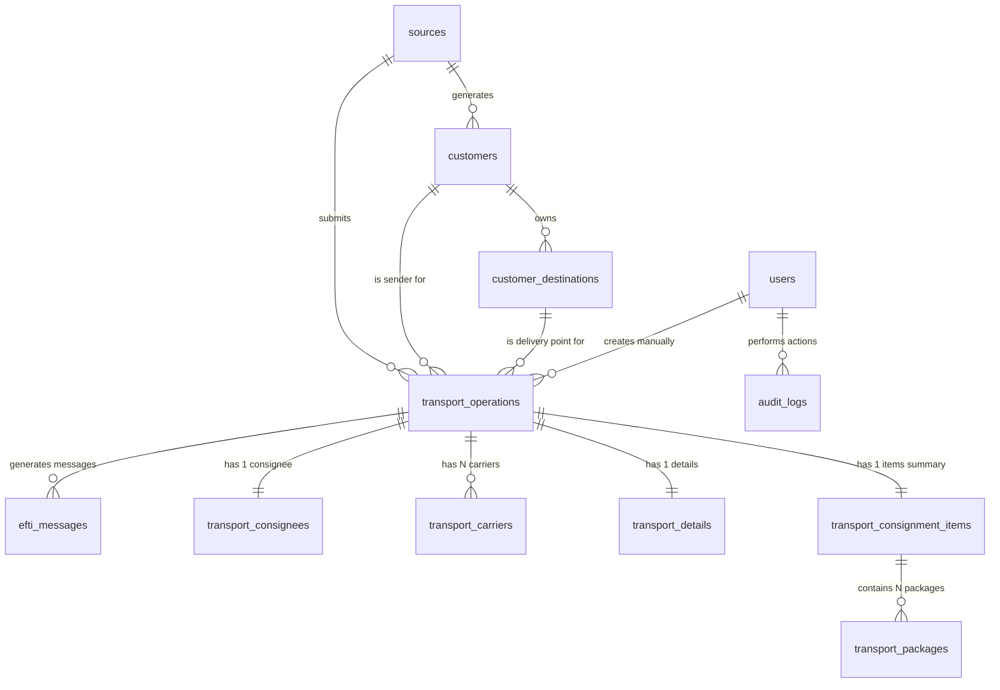
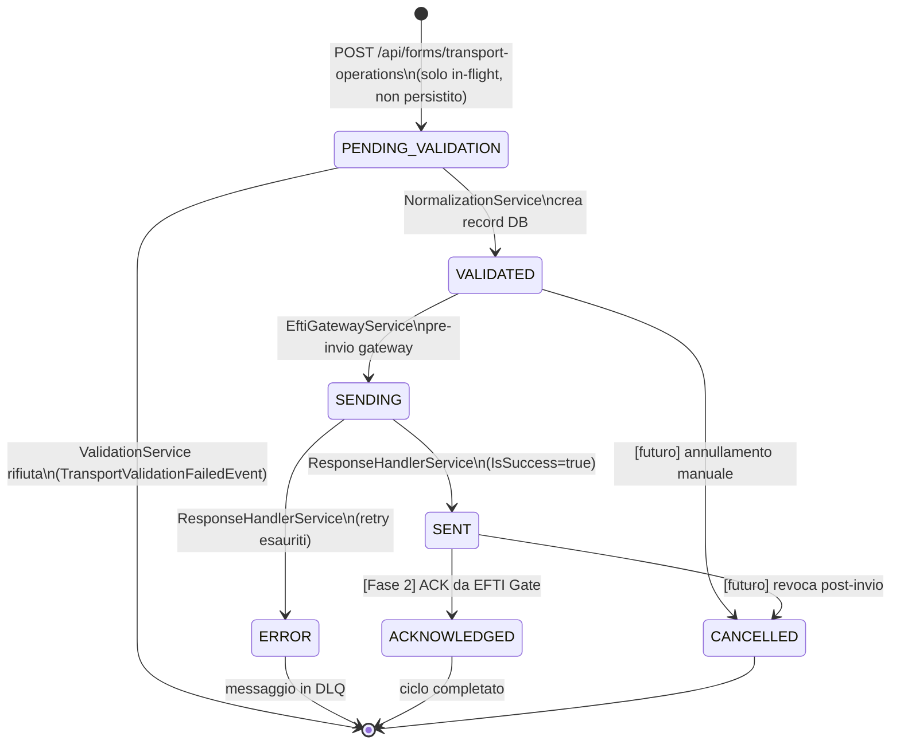
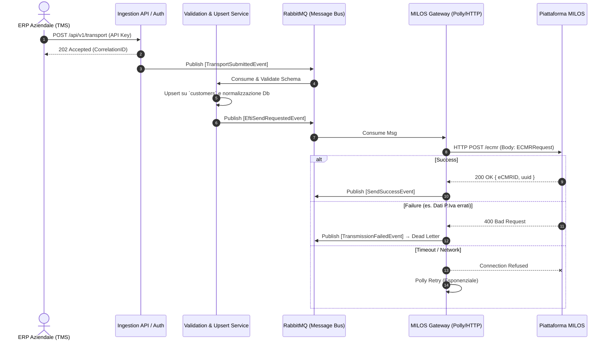

# EFTI Connector Platform — Documentazione Architetturale

> **Versione:** 2.2 · **Data:** Febbraio 2026  
> Documento di riferimento architetturale per il progetto **EFTI Connector Hub**.  
> Repository: [github.com/alisandre/ilp_efti_connector](https://github.com/alisandre/ilp_efti_connector) · Branch: `main`

---

## Indice

- [1. Introduzione e Contesto](#1-introduzione-e-contesto)
- [2. Strategia di Integrazione a Due Fasi](#2-strategia-di-integrazione-a-due-fasi)
- [3. Stack Tecnologico](#3-stack-tecnologico)
- [4. Diagramma del Database](#4-diagramma-del-database)
- [5. Architettura a Microservizi](#5-architettura-a-microservizi)
  - [5.1 Macro-Flusso dei Componenti](#51-macro-flusso-dei-componenti)
  - [5.2 Ciclo di Vita degli Stati — TransportOperation](#52-ciclo-di-vita-degli-stati--transportoperation)
- [6. Fase 1 — Integrazione con MILOS TFP](#6-fase-1--integrazione-con-milos-tfp)
- [7. Fase 2 — Integrazione Diretta con EFTI](#7-fase-2--integrazione-diretta-con-efti)
- [8. Frontend React](#8-frontend-react)
- [9. Sicurezza e Conformità Normativa](#9-sicurezza-e-conformità-normativa)
- [10. Deployment e Scalabilità](#10-deployment-e-scalabilità)
- [11. Stato di Implementazione](#11-stato-di-implementazione)

- [12. Guida all'Ambiente di Sviluppo](#12-guida-allambiente-di-sviluppo)
  - [12.1 Prerequisiti e Configurazione Locale (Docker Compose)](#121-prerequisiti-e-configurazione-locale)
  - [12.2 Struttura della Solution](#122-struttura-della-solution)
  - [12.3 Configurazione dei Servizi](#123-configurazione-dei-servizi)
  - [12.4 Progetti di Test e Verifica](#124-progetti-di-test-e-verifica)
- [13. Operations e CI/CD](#13-operations-e-cicd)
  - [13.1 CI/CD Pipeline](#131-cicd-pipeline)
  - [13.2 Produzione e Orchestrazione (Kubernetes)](#132-produzione-e-orchestrazione-kubernetes)
  - [13.3 Secrets Management e Security](#133-secrets-management-e-security)
  - [13.4 Monitoring, Health Checks e Logging](#134-monitoring-health-checks-e-logging)
  - [13.5 Runbook Operativo](#135-runbook-operativo)

---

## 1. Introduzione e Contesto

**EFTI** (Electronic Freight Transport Information) è il framework normativo europeo (Regolamento EU 2020/1056) che impone la digitalizzazione e la standardizzazione dei documenti di trasporto merci all'interno dell'Unione Europea. La piattaforma EFTI stabilisce le basi giuridiche e tecniche per consentire alle autorità pubbliche di controllo di accedere elettronicamente e in tempo reale alle informazioni di trasporto (eCMR per strada, eAWB per aereo, eBL per mare, eRSD per ferrovia).

L'applicazione descritta in questo documento è un **EFTI Connector Hub**: un componente middleware (architettura *Any-to-EFTI*) multi-sorgente che funge da gateway centralizzato verso l'infrastruttura EFTI. Questo hub permette a innumerevoli moduli aziendali preesistenti (TMS, WMS, ERP, software doganali, portali vettori) di comunicare in modo trasparente e uniforme con l'ecosistema istituzionale europeo, nascondendo la complessità dei protocolli di stato.

### 1.1 Obiettivi Principali

- **Centralizzazione e Disaccoppiamento:** Creare un singolo punto d'uscita verso EFTI, evitando *N* integrazioni punto-a-punto dispendiose da mantenere per ciascun software aziendale.
- **Supporto multi-sorgente omnicanale:** Accettare l'ingresso dati da moduli interni (tramite API REST e code di eventi), sistemi di terze parti e operatori umani (tramite interfaccia web dedicata).
- **Gestione autonoma dell'anagrafica (Upsert intelligente):** Mantenere un'anagrafica di clienti (mittenti) e destinazioni che si auto-popola e si aggiorna dinamicamente decodificando in corsa i payload degli ordini in transito.
- **Conformità e Validazione in-flight:** Garantire l'aderenza formale e semantica ai requirement normativi, validando l'input rispetto al rigoroso dataset standard europeo (EN 17532) prima della trasmissione.
- **Resilienza e Osservabilità Operativa:** Offrire un audit log immutabile (cruciale per compliance e GDPR), meccanismi di retry avanzati per indisponibilità di rete (backoff esponenziale) e gestione automatizzata degli scarti (Dead Letter Queue).
- **Gestione Manuale e Monitoraggio UI:** Fornire una Single Page Application moderna in React per permettere al team di supervisionare lo stato di invio dei viaggi, correggere errori o compilare documenti digitali a mano.

### 1.2 Punti Focali di Business e Sfide Normative

Il decollo dell'EFTI implica la sostituzione probatoria della carta in favore del formato puramente digitale basato su dati strutturati interconnessi (e non di semplici PDF inviati via mail). L'EFTI Connector Hub è pensato espressamente per affrontare questa transizione offrendo un vitale **layer di astrazione**:
1. **Adattabilità Normativa:** Quando le specifiche EU sull'eFTI si aggiornano (es. nuovi codici LOCODE obbligatori, variazioni minor al protocollo), l'azienda deve aggiornare solo il Connector, senza intervenire sul codice o patti d'integrazione degli svariati ERP retrostanti.
2. **Indipendenza dal Provider Esterno:** La capacità di passare dinamicamente da un partner terzo (es. la piattaforma MILOS usata per il ramp-up iniziale) ad una connessione istituzionale diretta con lo stato senza downtime, rappresentando di fatto una "polizza di assicurazione" tecnologica per l'azienda sul lungo termine.

---

## 2. Strategia di Integrazione a Due Fasi

L'integrazione verso l'infrastruttura EFTI istituzionale non è banale: richiede rigorose certificazioni crittografiche (X.509 qualificate, eIDAS, AS4) e l'interfacciamento con nodi europei (eFTI Gates) attualmente in via di finalizzazione in molti stati membri.
Per mitigare i rischi del progetto e consentire un test immediato sul campo (*time-to-market* ridotto), il Connector implementa un'architettura **bifase** basata su interfacce scambiabili dinamicamente.

### 2.1 Fase 1 — Integrazione via Provider Intermediario MILOS TFP (MVP)

In questa fase iniziale, il Connector si affida a **MILOS TFP** (piattaforma commerciale di Circle SpA) in veste di broker intermediario accreditato. Il Connector invia i dati di trasporto a MILOS usando semplici API REST. MILOS si fa carico di tutta la complessità crittografica e di "traduzione" governativa: convalida finale, invio sui nodi EFTI di stato e generazione del **QR Code di viaggio** (obbligatorio per i controlli della polizia stradale).

**I vantaggi di questa fase del MVP:**
- Barriera d'ingresso abbassata (si ignorano i protocolli complessi come eDelivery AS4).
- Nessun acquisto e mantenimento immediato di certificati digitali per gli hub o test eIDAS.
- Rollout rapido dei moduli TMS in produzione, permettendo all'azienda di digitalizzare le spedizioni.
- Ottimo per le sessioni di training degli operatori di piazzale e doganali.

### 2.2 Fase 2 — Integrazione Diretta e Nativa con l'EFTI Gate di Stato (Evolutiva)

Inizierà la sostituzione di MILOS. Il Connector attiverà la capacità di comunicare **direttamente con gli EFTI Gate istituzionali** (italiani o europei). Il layer di astrazione architetturale fa sì che questo *salto* avvenga a costo di sviluppo quasi nullo per il resto del sistema.

**I cambiamenti in Fase 2:**
- Indipendenza assoluta: zero costi ricorrenti verso intermediari di terze parti e SLA gestiti internamente.
- Gestione in house delle firme crittografiche qualificate, delle connessioni via AS4 e token basati su OAuth2 via Mutual TLS (mTLS).
- Il provider MILOS diventa una connessione di fallback di emergenza.

### 2.3 Astrazione e Feature Flags (Pattern `Strategy`)

A livello di codice, il Core del Connector non conosce i dettagli né di MILOS né di EFTI Gate. Conosce solo un'interfaccia standardizzata (`IEftiGateway`). Questa struttura permette al sistema di deviare i messaggi sull'uno o sull'altro in millisecondi in base alla configurazione.

```csharp
// L'interfaccia architetturale immutabile sia in Fase 1 che in Fase 2
public interface IEftiGateway
{
    Task<EftiSendResult>      SendEcmrAsync(EcmrPayload payload, CancellationToken ct);
    Task<EftiSendResult>      UpdateEcmrAsync(string ecmrId, EcmrPayload payload, CancellationToken ct);
    Task<EftiSendResult>      DeleteEcmrAsync(string ecmrId, CancellationToken ct);
    Task<EcmrPayload>         GetEcmrAsync(string ecmrId, CancellationToken ct);
    Task<GatewayHealthStatus> HealthCheckAsync(CancellationToken ct = default);
}

// Fase 1: Classe implementativa che traduce in chiamate REST verso MILOS
public class MilosTfpGateway : IEftiGateway { /* ... */ }

// Fase 2: Classe che traduce il payload e usa certificati di stato EFTI e AS4
public class EftiNativeGateway : IEftiGateway { /* ... */ }
```

Il cambio del comportamento avviene *live* alterando la configurazione, senza dover ricompilare o fermare in blocco il servizio:

```json
{
  "EftiGateway": {
    "Provider": "Milos", // Switch operativo tra "Milos" o "EftiNative"
    "Milos": {
      "BaseUrl": "https://milos.provider.example/api/",
      "ApiKey": "<secret-from-vault>"
    },
    "EftiNative": {
      "BaseUrl": "https://efti-gate.gov.it/api/",
      "ClientId": "<oauth2-client-id>",
      "CertificatePath": "<secret-from-vault>"
    }
  }
}
```

---

## 3. Stack Tecnologico

Il Connector adotta principi di *Cloud-Native Development*: containerizzazione rigorosa, elaborazione asincrona a eventi, pattern moderni per l'infrastruttura Microsoft e isolamento delle componenti frontend/backend.

### 3.1 Backend Enterprise in .NET 9

L'applicativo si affida alle ultime tecnologie del framework Microsoft, studiato per latenze minime e massimi carichi in multi-threading.

| Scopo Core | Componente / Framework | Note Operative |
|---|---|---|
| Framwork Base | **.NET 9** (C# 13) | Performance estreme nella gestione della I/O HTTP e serializzazione Json. |
| API Layer | **ASP.NET Core Web API** | Minimal API con OpenAPI (Swagger) esposto per documentare i contatti verso team terzi. |
| Message Bus | **MassTransit + RabbitMQ** | Orchestrazione degli eventi interni (es. *EcmrValidated*, *TransmissionFailed*). Assicura solidità in caso di picchi. |
| Data Access | **Entity Framework Core 9** | Object-Relational Mapper (ORM) connesso a driver di alto livello (*Pomelo.EntityFrameworkCore.MySql*). |
| Resilienza H/C | **Polly v8** | Policy avanzate di timeout per le chiamate HTTP, es. *Circuit Breaker* (quando EFTI Gate o MILOS cadono), Retry ed Exponential backoff. |
| Retry Asincroni | **Hangfire** | Scheduling della logica per ri-processare ordini scartati dal gateway e per lavori notturni (vacuum dati). |
| Sicurezza Auth | **Keycloak (OAuth2/OIDC)** | Identity Provider decentralizzato per utenti umani (Dashboard) e generazione di token Machine-to-Machine. |
| Telemetria | **Serilog + Seq** | Logging JSON strutturato. Trace ID propagati tra i microservizi per correlare gli errori in log distribuiti. |

### 3.2 Frontend (Management ed Entry Point Umano)

Una Single Page Application studiata per reattività ed ergonomia per il personale logistico.

| Ruolo Componente | Strumento Frontend | Dettagli di Utilizzo |
|---|---|---|
| Piattaforma SPA | **React 19 + TypeScript** | Robustezza al compilatore e modern hook pattern. Tooling di aggregazione via **Vite**. |
| Interfaccia Dati | **Ant Design / MUI** | Utilizzati intensivamente per griglie complesse (*TanStack Table*) con filtri a colonne su migliaia di transiti logistici. |
| Form & Controlli | **React Hook Form + Zod** | Tutti i form (es: compilazione Ddt/Ecmr manuali a mano quando l'ERP fallisce) sono protetti da validazioni Zod sincronizzate con le logiche backend. |
| Cache & Dati | **Zustand + React Query** | Gestione locale dello stato applicativo e server state ri-validato dal vivo evitando chiamate inefficaci e colli di bottiglia all'API. |

### 3.3 Persistenza Dati e Servizi Infrastrutturali

Tecnologie open source classiche scalabili affidate a storage persistente e clusterizzabile.

| Layer di Rete | Tecnologia | Utilizzo nel Sistema |
|---|---|---|
| Database Transazionale | **MariaDB 11.4** LTS | Custode inesorabile degli Audit Log immutabili, stati avanzamento spedizioni, anagrafiche aziende clienti e vettori. |
| Cache in RAM & Lock | **Redis 7** | Usato massicciamente per memorizzare i token Bearer di ritorno, imporre Rate-Limiting alle richieste ERP per abuso e gestire lock distribuiti su ID doppioni. |
| Code asincrone | **RabbitMQ 3.13** | Scatola d'ingranaggi pulsante per i messaggi tra l'esposizione del Connector e e l'invio fisico dell'eCMR (Pattern Produce/Consumer). |
| Binary Storage | **MinIO (S3 compatibile)** | *[Futuro]* Necessario per accogliere foto dei carichi, moduli autografati digitalmente, file di bolle tradotti e file di attestazione scannerizzati generati. |

---

## 4. Diagramma del Database

Il database transazionale **MariaDB 11.4** è strutturato in **12 tabelle** interconnesse, ottimizzate per la deduplicazione anagrafica e la tracciabilità delle operazioni. Lo schema è stato progettato per restare **invariato** in caso di transizione dalla Fase 1 alla Fase 2.



---

### 4.1 Tabella: `customers`

Anagrafica dei mittenti principali (spesso i clienti dell'azienda che installa il Connector).

| Colonna | Tipo | Vincolo | Descrizione |
|---|---|---|---|
| `id` | `CHAR(36)` | PK | UUID interno |
| `customer_code` | `VARCHAR(100)` | UNIQUE NOT NULL | Codice cliente dal sorgente ERP — **chiave di lookup** per upsert automatico |
| `business_name` | `VARCHAR(300)` | NOT NULL | Ragione sociale del mittente |
| `vat_number` | `VARCHAR(50)` | | Partita IVA / VAT number |
| `eori_code` | `VARCHAR(20)` | | Codice EORI (obbligatorio in EFTI per tratte cross-border) |
| `is_active` | `BOOLEAN` | DEFAULT true | Soft delete /abilitazione |
| `auto_created` | `BOOLEAN` | DEFAULT false | `true` = creato automaticamente da un payload in corsa, nessuna validazione umana |
| `source_id` | `CHAR(36)` | FK `sources` | Sorgente che ha generato la creazione automatica |

### 4.2 Tabella: `customer_destinations`

Indirizzi di scarico e terminal associati a un `customer` specifico. Si auto-popolano grazie a `destination_code`.

| Colonna | Tipo | Vincolo | Descrizione |
|---|---|---|---|
| `id` | `CHAR(36)` | PK | UUID interno |
| `customer_id` | `CHAR(36)` | FK `customers` NOT NULL | Cliente proprietario |
| `destination_code` | `VARCHAR(100)` | UNIQUE NOT NULL | Codice destinazione dal sorgente |
| `address_line1` | `VARCHAR(300)` | NOT NULL | Via e numero civico |
| `city` | `VARCHAR(200)` | NOT NULL | Città e `country_code` (ISO 3166-1 alpha-2) |
| `un_locode` | `VARCHAR(10)` | | Codice UN/LOCODE (fondamentale per le direttive marittime e ferrovia) |
| `is_default` | `BOOLEAN` | DEFAULT false | Usata per fallback form UI |

**Logica di Upsert Anagrafico Intelligente** (Avviene al volo, pre-invio):
1. Cerca il record `WHERE customer_code = :code`.
2. Se trovato, esegue `UPDATE` di p.iva o campi disallineati se più recenti.
3. Se non trovata, lo crea al volo (`INSERT` con flag `auto_created = true`).

### 4.3 Tabella: `sources`

I sistemi che parlano con il Connector. Ognuno ha una API Key dedicata (hashata) per motivi di auditing e partizionamento.

| Colonna | Tipo | Vincolo | Descrizione |
|---|---|---|---|
| `id` | `CHAR(36)` | PK | Identificatore univoco |
| `code` | `VARCHAR(50)` | UNIQUE NOT NULL | Es. `TMS_MAGAZZINO_A`, `ERP_SAP_FINANCE` |
| `type` | `VARCHAR(20)` | NOT NULL | Enum: `TMS` \| `WMS` \| `ERP` \| `MANUAL` (Front-end) |
| `api_key_hash` | `VARCHAR(64)` | | Hash SHA-256 della API key Bearer usata |
| `config_json` | `JSON` | | Configurazione flessibile per custom Webhook payload URLs di ritorno |

### 4.4 Tabella: `transport_operations`

È il cuore del business logistico. Traccia la spedizione logica astraendo dalla singola chiamata HTTP.

| Colonna | Tipo | Vincolo | Descrizione |
|---|---|---|---|
| `id` | `CHAR(36)` | PK | UUID operazione logistica |
| `operation_code` | `VARCHAR(100)` | NOT NULL INDEXED | Codice univoco CMR/DDT (spesso `eCMRID` per MILOS) |
| `dataset_type` | `VARCHAR(50)` | NOT NULL | `ECMR` (Strada) \| `EDDT` (DDT interno) |
| `status` | `VARCHAR(30)` | NOT NULL | `DRAFT`, `VALIDATED`, `SENDING`, `SENT`, `ERROR`, ecc. |
| `hashcode` | `VARCHAR(64)` | | Hash SHA-256 matematico del payload (richiesto per fini legali e non modificabilità) |
| `raw_payload_json` | `JSON` | | Fotografia del JSON originale prima delle normalizzazioni (utile in caso di dispute e debug) |

### 4.5 Tabella: `efti_messages`

Tabella che traccia i *tentativi fisici* di comunicazione verso il nodo di stato (invariata tra F1 e F2).

| Colonna | Tipo | Vincolo | Descrizione |
|---|---|---|---|
| `gateway_provider` | `VARCHAR(20)` | NOT NULL | `MILOS` \| `EFTI_NATIVE` |
| `direction` | `VARCHAR(10)` | NOT NULL | `INBOUND` \| `OUTBOUND` |
| `status` | `VARCHAR(20)` | NOT NULL INDEXED | `PENDING`, `ACKNOWLEDGED`, `RETRY`, `DEAD` |
| `external_id` | `VARCHAR(100)` | INDEXED | F1: `eCMRID` da MILOS — F2: `UUID/MessageId` di stato EFTI |
| `retry_count` | `SMALLINT` | DEFAULT 0 | Fondamentale per backoff asincrono (Hangfire) |

### 4.6 — 4.10 Tabelle `transport_*` minori (Normalizzazione Payload)

I dati del viaggio non vivono tutti in file JSON: vengono disassemblati ed esplosi in tabelle relazionali per poter fare statistiche e filtri d'interfaccia complessi (es. "Mostrami tutti i viaggi dove il vettore si chiama X").

- `transport_consignees`: Chi riceve la merce (Street, City, EORI).
- `transport_carriers`: Lista ordinata (1..N) di chi fisicamente trasporta (camionista/azienda). Campo importante: `tractor_plate` (targa motrice).
- `transport_details`: Aspetti contrattuali. `incoterms` (EXW, DAP, FOB), `cargo_type` (FTL/LTL) o luoghi di Presa In Carico contrattuale.
- `transport_consignment_items`: I pesi e volumi totali in kilogrammi o metri cubi (es: 12.000 kg totali).
- `transport_packages`: Splittaggio al dettaglio in righe del carico, con descrizioni. Es: "Bancali", "Box", "Reefer" e i singoli pesi (es: 1200kg colli 1-5, 500kg colli 6-30).

### 4.11 e 4.12 Sicurezza: `users` e `audit_logs`

I log GDPR immutabili previsti per Art. 5 Reg. EU 2020/1056. È la "Security Box" legale.

- L'entità `audit_logs` **non ha permessi di DELETE** a livello database.
- Memorizza il JSON del record prima (`old_value_json`) e dopo la modifica (`new_value_json`).
- Si incrocia nativamente via `keycloak_id` per identificare l'umano o via `api_key_hash` per le automazioni.

---

## 5. Architettura a Microservizi (Message-Driven)

Il backend è segmentato internamente usando il pattern In-Memory Publisher/Subscriber (MassTransit + RabbitMQ) per garantire fault-tolerance. Se un servizio vitale come l'invio esterno fallisce, l'ingestione tramite API non si blocca e non perde chiamate dall'ERP.

### 5.1 Macro-Flusso dei Componenti 

1. **Ingestion & API Gateway Service (`Source Ingestion`)**: Espone la porta `POST /api/v1/transport` per l'ingresso da TMS/WMS esterni. Autentica il Jwt/API Key, verifica i limiti (Rate Limiting via Redis) e converte la richiesta sincrona in un pacchetto `TransportSubmitted` asincrono gettato su code RabbitMQ. Restituisce HTTP 202.
2. **Validation Service**: Pesca il body e ne applica validazioni formali.
   - Fase 1: Verifica presenza chiavi minime per i provider di mercato (MILOS chiede almeno P.IVA valida, Targa, Nazione ISO).
   - Fase 2: Check formale *EN 17532* (struttura xml/json e id semanticamente stretti). Pubblica `TransportValidated` o genera eccezione notificata in dashboard.
3. **Normalization & Mapping Service**: Cuore della logica transazionale interna. Applica la logica di *Upsert* esposta nella Sezione 4 sulle anagrafiche e genera le insert EF Core nel DB. Riformatta poi la stringa trasformandola da lingua universale a JSON proprietario di MILOS e apre la pratica in stato `VALIDATED` (pronta per l'invio).
4. **EFTI Gateway Service *(Componente Bifasico Core)***: 
   - Iniettato tramite `GatewaySelector` a runtime.
   - Si serve di circuit breaker (`Polly v8 GatewayResilienceHandler`).
   - Se il provider non risponde (es. MILOS in manutenzione programmata), ingabbia le eccezioni, mette il messaggio in status transitorio e demanda il problema a Hangfire per retry.
5. **Response Handler e Webhook Notification Service**: Al check di ritorno OK dal provider. Esegue query su anagrafiche webhook e spara post HTTP all'indietro per svegliare e notificare in automatico gli ERP (così che i terminalisti possano far partire i camion col QR generato). In contemporanea, aggiorna in SSE (Server-Sent-Events) le UI React affinché i cruscotti diventino verdi real-time.
6. **Query Proxy e Audit Service**: Endpoints per lettura read-only (es `GET /query/operations?page=3`). È l'unico punto che interagisce pesantemente con Redis cache per non uccidere il DB e appende **obbligatoriamente** righe sull'Audit GDPR per tracciare chi (quale autorità stradale e umana) ha sbirciato la lettera di vettura.

---

### 5.2 Ciclo di Vita degli Stati — `TransportOperation`

Ogni `TransportOperation` percorre una macchina a stati precisa. Gli stati sono definiti nell'enum `TransportOperationStatus` (dominio) e persistiti nella colonna `status` della tabella `transport_operations`.

#### Tabella stati

| Stato | Valore DB | Servizio responsabile | Evento/trigger | Note |
|---|---|---|---|---|
| *(concettuale)* | — | — | Payload ricevuto dall'API, **non ancora in DB** | Il record non esiste ancora: l'operazione è in attesa di validazione sulla coda RabbitMQ |
| `VALIDATED` | `VALIDATED` | `NormalizationService` via `SubmitTransportOperationCommandHandler` | Consumo `TransportValidatedEvent` | **Primo stato persistito in DB.** Viene creato solo dopo che `ValidationService` ha già verificato il payload |
| `SENDING` | `SENDING` | `EftiGatewayService` (`EftiSendRequestedConsumer`) | Prima della chiamata HTTP verso MILOS / EFTI Gate | Stato transitorio che segnala che l'invio è in corso; utile per evitare doppi invii in caso di crash |
| `SENT` | `SENT` | `ResponseHandlerService` (`EftiResponseReceivedConsumer`) | `EftiResponseReceivedEvent` con `IsSuccess = true` | Il gateway ha accettato la richiesta. `EftiMessage.external_id` è valorizzato |
| `ERROR` | `ERROR` | `ResponseHandlerService` | `EftiResponseReceivedEvent` con `IsSuccess = false` dopo esaurimento retry | Numero massimo di tentativi (default 3) superato. Il messaggio passa in `DEAD` su `EftiMessage` |
| `ACKNOWLEDGED` | `ACKNOWLEDGED` | *(futuro — Fase 2)* | Conferma asincrona dal nodo EFTI Gate di stato | Riservato per Fase 2: il gate governativo conferma la ricezione definitiva del documento |
| `DRAFT` | `DRAFT` | *(futuro — form UI)* | Salvataggio parziale manuale dall'operatore | Riservato per bozze salvate dall'interfaccia form prima dell'invio definitivo |
| `CANCELLED` | `CANCELLED` | *(futuro — API admin)* | Richiesta esplicita di annullamento | Operazione annullata prima del completamento; corrisponde a `DELETE /ecmr/{id}` su MILOS |

> **⚠️ Nota:** Lo stato `PENDING_VALIDATION` è definito nell'enum ma **non viene mai persistito** nel flusso attuale. È uno stato concettuale che descrive la finestra di tempo tra la pubblicazione dell'evento su RabbitMQ e la creazione del record DB da parte del `NormalizationService`. Il primo stato scritto su DB è sempre `VALIDATED`.

#### Diagramma delle transizioni



#### Transizioni sullo stato di `EftiMessage`

Ogni `TransportOperation` genera almeno un `EftiMessage` che tiene traccia dei *tentativi fisici* di comunicazione. I due stati sono ortogonali ma correlati.

| `EftiMessage.status` | Chi lo imposta | Quando |
|---|---|---|
| `PENDING` | `NormalizationService` (creazione) | Record creato insieme alla `TransportOperation` |
| `SENT` | `EftiGatewayService` + `ResponseHandlerService` | Dopo la chiamata HTTP riuscita al gateway |
| `ERROR` | `EftiGatewayService` | Deserializzazione payload fallita |
| `RETRY` | `ResponseHandlerService` | Risposta negativa, `retry_count < MAX_RETRY` (default 3) |
| `DEAD` | `ResponseHandlerService` | `retry_count >= MAX_RETRY` — messaggio finisce in DLQ |

---

## 6. Fase 1 — Integrazione con MILOS TFP (MVP)

### 6.1 Overview MILOS TFP (Partner Tecnologico)

Per accelerare il *time-to-market* e bypassare le complessità della certificazione crittografica eIDAS ed eDelivery AS4 (richieste dai nodi di stato), la **Fase 1** adotta l'hub di mercato **MILOS TFP** (sviluppato da Circle SpA) come Intermediario Fiduciario accreditato. 

MILOS offre all'EFTI Connector due layer architetturali trasparenti in cascata:
- **e-CMR Service**: Un modulo di business puro per la compilazione della Lettera di Vettura Elettronica. È l'interfaccia con cui il Connector dialoga.
- **eFTI / UUM&DS Platform**: Il motore che, invisibilmente, prende i dati dell'e-CMR, li impacchetta secondo la semantica **EN 17532**, firma digitalmente (tramite HSM / Accudire) e invia il plico al nodo EFTI nazionale. Inoltre genera il **QR Code univoco** da stampare o fornire sull'app dell'autista, fondamentale per ispezioni su strada.

### 6.2 Contratti API (e-CMR Service)

Le chiamate dal nostro *EFTI Gateway Service* a MILOS avvengono via **REST JSON (TLS 1.3)** e sono protette da *API Key* statica (long-lived) injectata tramite Vault di configurazione.

**Endpoint Base**: `https://<milos-environment-url>/api/ecmr-service/`

| Operazione | Metodo HTTP | Percorso Relativo | Scopo |
|---|---|---|---|
| **Issue e-CMR** | `POST` | `ecmr` | Invia un nuovo trasporto. Ritorna `eCMRID` autogenerato. |
| **Update / Amend**| `PUT` | `ecmr/{id}` | Aggiorna dati di un viaggio non ancora chiuso (es. cambio targa). |
| **Cancel** | `DELETE` | `ecmr/{id}` | Abortisce legalmente l'operazione. |
| **Retrieve** | `GET` | `ecmr/get/{id}` | Forza un allineamento dello stato se i webhook di MILOS falliscono. |

### 6.3 Data Mapping `ECMRRequest` vs Internal Model

La mappatura è condotta dal *Normalization Service*. Ogni JSON transita attraverso la classe DTO `ECMRRequest` pretesa da MILOS. I campi principali sono associati come segue:

| Nodo MILOS `ECMRRequest` | Entità DB / Tabella Origine | Note e Regole di business |
|---|---|---|
| `shipping.eCMRID` | `transport_operations.operation_code` | Chiave di correlazione idempotente originata dal TMS. |
| `consignorSender.*` | `customers` & `customer_destinations` | Dati Mittente e indirizzo pick-up. P.Iva o *EORI Code* obbligatori. |
| `consignee.*` | `transport_consignees` | Destinatario finale (Receiver) e relativo scarico. |
| `carriers[i].*` | `transport_carriers` | Array dei vettori. **`tractorPlate`** è blindato e obbligatorio per i controlli del QR Code stradale. |
| `includedConsignmentItems` | `transport_packages` (totali & colli) | Sommatoria logica di pesi, numero colli, volumi e *shippingMarks*. |
| `transportDetails.incoterms` | `transport_details.incoterms` | Condizioni di resa della merce (DAP, EXW, ecc.). |
| `hashcodeDetails` | Elaborazione generata *in-transit* (C#) | Hash SHA-256 applicato all'intero payload pulito. La Piattaforma di stato scarta richieste con hash asimmetrico. |

### 6.4 Sequenza Outbound (Fase 1)

Il seguente diagramma modella il viaggio di un payload all'interno della rete a microservizi nella Fase 1.



---

## 7. Fase 2 — Integrazione Diretta con l'EFTI Gate di Stato

### 7.1 Overview del Paradigma Nativo

L'evoluzione prevista per il prodotto rimuove l'intermediario commerciale (MILOS) instaurando un canale *Machine-to-Machine* puro (M2M) direttamente verso i nodi (EFTI Gate) predisposti dagli Stati dell'Unione Europea. Questo approccio è **disaccoppiato contrattualmente** e garantisce alla piattaforma logistica una forte *Self-Sovereignty* digitale.

### 7.2 Protocolli e Standard (Architettura di Rete EU)

La connettività passa da una classica interazione "Web API API-Key based" a un'infrastruttura Enterprise regolamentata istituzionalmente:

| Modulo Normativo | Specifica Tecnica Implementativa |
|---|---|
| **Data Payload (Standard)** | Conversione dal linguaggio interno verso XML/JSON secondo i rigidi standard UML europei **EN 17532**. |
| **Livello Trasporto (B2G)** | Protocollo **eDelivery / AS4** su base mutual TLS (mTLS), obbligatorio per l'interoperabilità sicura e il non-ripudio. |
| **Trust e Identità** | Passaggio dall'API Key al rilascio di **Token OAuth2 via eIDAS**, corroborati da *Certificati X.509 EU* archiviati in *Key Vault*. |
| **Sicurezza Apposizione** | Modulo interno di **Firma Elettronica Qualificata (QES)** e generazione autonoma dell'URI dinamico (per il QR Code sul fronte mezzo). |

### 7.3 Tabella Comparativa di Transizione

Identificare in modo chirurgico i confini di mutamento garantisce di minimizzare gli impatti di codice durante questa evoluzione:

| Strato Architetturale | Fase 1 (MILOS) | Fase 2 (EFTI Nativo) | Impatto di Riscrittura |
|---|---|---|---|
| **Interfaccia ERP (Ingresso)** | Webhook JSON custom + REST | Webhook JSON custom + REST | Nessuno |
| **Database Strutturale** | MariaDB Relazionale | MariaDB Relazionale | Nessuno |
| **Autenticazione Gateway** | API Key in header (`Authorization`) | M2M OAuth2 Token (Redis Cache) + X.509 | Isolato nel `GatewaySelector` |
| **Payload Esterno** | Classe `.NET` `ECMRRequest` custom | Dataset standardizzato EN 17532 | Sviluppo di un nuovo Mapping Service dedicato |
| **QR Code / Ispezioni** | Generato remotamente da MILOS | Generato e firmato dall'EFTI Connector stesso | Richiede libreria dedicata + QES |
| **GDPR & Autorità (Audit)** | Le Polizie Stradali interrogano MILOS | Il *Query Proxy Service* deve esporre API pubbliche traccianti | Esporre Endpoints Pubblici e log su DB |

### 7.4 Flusso Operativo della Transizione (Zero-Downtime)

La sostituzione del provider in linea di produzione è gestita in ottica *Circuit Toggle* (Feature Flag) accoppiata ad un rollout morbido in Kubernetes (k8s), per prevenire disservizi ai mezzi in parcheggio:

1. **Deployment Ombra:** Le classi `EftiNativeGateway` (il nuovo SDK) vengono deployate su tutti i pod logici dormienti (inattive).
2. **Flag Flip:** Da pannello Admin (React UI), o alterando un `ConfigMap`, il flag applicativo `EftiGateway.Provider` muta da `"Milos"` a `"EftiNative"`.
3. **Drain delle Code:** RabbitMQ instrada lecendosi nativamente i nuovi payload in ingresso alla nuova pipeline del mapper *EN 17532*.
4. **Smaltimento Graceful:** I messaggi *in-volo* pendenti nella coda legata a MILOS vengono progressivamente processati in background senza venir abortiti malamente.
5. **Fallback Safety:** Qualsiasi criticità di handshake Oauth2 o timeout AS4 sul nodo statale produce allarmi immediati (Prometheus/Serilog). È sufficiente deflaggare in UI l'hub statale per deviare nuovamente il fiume transazionale sul rassicurante backup MILOS in meno di un secondo.

---

## 8. Frontend React — Pannello di Gestione

Una Single Page Application (SPA) realizzata in **React 19 + TypeScript**, dotata di design system ergonomico per gli operatori logistici (Ant Design / MUI). 
Il front-end funge da "torre di controllo" per esaminare in tempo reale il flusso B2B generato dagli ERP, intervenendo dove necessario e amministrando parametri di sistema.

### 8.1 Struttura e Architettura UI

| Modulo UI | Ruolo nel dominio |
|---|---|
| **Vite & TS** | Bundler ultraveloce (HMR) e sicurezza al transpiling sui DTO di rete per eliminare "undefined is not a function". |
| **Zustand + React Query** | Il client memorizza localmente lo stato dell'interfaccia (Zustand). I dati asincroni dalle API sono invece serviti, con caching a 5 min, da *TanStack React Query*. |
| **SSE (Server-Sent Events)**| Mantengono *live* il cruscotto: un CMR che passa a "Errore" accende una spia rossa nello schermo dell'operatore senza bisogno di refresh della pagina (Polling). |
| **Keycloak Auth** | Login centralizzato. Genera un Bearer Token per le restrizioni di Role-Based Access Control (es: utente "Viewer" vs "Admin"). |

### 8.2 Funzionalità Business

- **Dashboard Real-Time**: KPI aggregati sui volumi della settimana, tassi di scarto MILOS, e un **Badge di status globale** ben visibile che chiarisce in quale fase (1 MILOS o 2 STATO) sta lavorando il Connector.
- **Griglia Spedizioni (e-CMR)**: Elenca ogni operazione con filtri testuali rapidi per CMR id, P.Iva, Nazione e Targa del Trattore. Modalità di export nativo CSV o JSON.
- **Operazioni Manuali (Form)**: Pensato come backup in caso di *down* dei gestionali interni. Strutturato tramite form dinamici e complessi (via *React Hook Form* & Zod object validation). Consente ad un umano di compilare graficamente e per intero una Lettera di Vettura e premere INVIA.
- **Anagrafica Adattiva**: Specchio delle tabelle SQL `customers`. Presenta interruttori "Soft-Delete", moduli di sovrascrittura di un indirizzo di consegna (LOCODE) ed evidenzia chiaramente i record etichettati `<Auto-Created>` dai flussi notturni che meritano un check dell'operatore.
- **Dead Letter Queue (I fallimenti)**: Un'infermeria dove finiscono i payload in coma (es: Partita IVA non formattata logicamente, superati i 6 tentativi automatici di Hangfire). L'utente può editare il JSON grezzo ed eseguire un riprocessamento manuale ("Re-Queue").

### 8.3 Il Pannello Admin System

Fondamentale per i DevOps e i manager tecnici. Oltre alla gestione delle API keys e la rotazione dei ruoli, contiene lo **Switch Bifasico**:

```
┌───────────────────────────────────────────────┐
│ ⚙️ Gestione Gateway EFTI — Ambiente di Prod   │
│                                               │
│    Provider attivo al momento:                │
│    ○ MILOS Partner Com.   ● EFTI Nativo M2M   │
│                                               │
│   [Stato: ✓ Connesso]  · [Ping: 12ms]         │
└───────────────────────────────────────────────┘
```
L'interazione con questo switch richiama le API admin del *GatewaySelector* provocando in frazioni di secondo lo shift del routing dietro le quinte.

---

## 9. Sicurezza e Conformità Normativa

La natura istituzionale e "Legal Tech" della piattaforma EFTI richiede garanzie di sicurezza pari a quelle dei sistemi bancari. Sostituendo la lettera di vettura cartacea firmata a penna con dati puramente digitali, i rischi collegati a *tampering* (falsificazione di documenti di trasporto) e infrazioni GDPR risultano i driver primari dell'architettura di sicurezza.

### 9.1 Identità, Autenticazione ed RBAC

- **Autenticazione Macchina-Macchina (M2M):** Gli ERP sorgente non usano password umane, ma interagiscono con il *Connector API Gateway* avvalendosi di Json Web Token (JWT) rilasciati da Keycloak o tramite API Key con hashing forte (SHA-256) salvate su Vault.
- **Micro-segmentazione e Zero-Trust:** Nel cluster Kubernetes di produzione, i microservizi dialogano esclusivamente tramite `mTLS` (Mutual TLS). Se un attore malevolo riuscisse a bucare l'interfaccia React, non potrebbe mai eseguire una query su MariaDB, poiché il DB accetta connessioni solo dai pod legittimati dalla PKI interna.
- **Roles-Based Access Control (RBAC) granulare:** Nel Frontend React, i permessi di lettura JSON, sovrascrittura forzata (DLQ) o cambio Provider (MILOS ↔ Nativo) sono vincolati a scope specifici restituiti dagli *Access Token* OAuth2.

### 9.2 Protezione del Dato e Crittografia (Data-at-Rest & In-Flight)

La confidenzialità commerciale (es: il costo di un trasporto, la tipologia di merce e l'identità del cliente finale) è vitale per le aziende logistiche.

- **Fase 1 (MILOS):** Le comunicazioni avvengono tramite **TLS 1.3**. Per garantire l'integrità durante la trasmissione, l'SDK `.NET` calcola un Hash SHA-256 esatto dell'intero payload (`ECMRRequest`), allegandolo come `hashcodeDetails`. MILOS rispedisce errore se l'hash ricalcolato non combacia (prevenzione Man-In-The-Middle attacks).
- **Fase 2 (EFTI Nativo - Imminente):** L'impianto crittografico scala verso gli standard governativi. 
  - Archiviazione di **Certificati X.509 (Qualificati EU)** in Azure Key Vault / HashiCorp.
  - Firma Elettronica Qualificata (QES) eIDAS per apporre il sigillo legale al pacchetto aziendale.
  - Implementazione del rigido protocollo di messaggistica inter-nazionale **AS4 via eDelivery**, che assicura crittografia asimmetrica *End-to-End* fino al ministero competente.
- **Storage Encryption:** Il Database transazionale prevede crittografia a riposo nativa sul volume disco. Per dati altamente sensibili, le colonne JSON in EF Core sono decifrate a runtime via funzioni `AES_DECRYPT()`.

### 9.3 Conformità Legislativa EFTI e GDPR Audit Logging

Il Regolamento (UE) 2020/1056 impone che ogni accesso umano o di sistema ai dati logistici da parte di soggetti terzi avvenga in modo inequivocabilmente tracciabile.

- **Pattern *Append-Only Audit Log*:** Le entità `users` e i sistemi sorgenti che operano un CRUD non cancellano né sovrascrivono i record transitati, ma inseriscono istruzioni nella tabella segregata `audit_logs` priva di trigger di `DELETE`.
- **Interfaccia e Autorità di Controllo:** 
  - *(Fase 1)*: Le autorità (es. agenti di stradale in ispezione) interrogano il nodo MILOS inserendo l'UUID del QR Code. MILOS si fa garante del tracciamento.
  - *(Fase 2)*: Sarà il nostro *Query Proxy Service* a dover soddisfare le interrogazioni istituzionali per conto del cliente aziendale. Un middleware intercetta la Action API e obbliga ad applicare un Audit Entry, comprensivo di IP, Identificatore Agente e timestamp, prima di restituire il Payload del Documento Logistico.
- **Data Lifecycle (Purging automatico):** Un job cron *Hangfire* anonimizza ed espunge permanentemente i record transattivi vecchi di *N* mesi (parametro GDPR aziendale configurabile per sorgente), lasciando solo aggregati statistici, sollevando l'azienda dai costi di Cloud Storage evitabili.

---

## 10. Deployment e Scalabilità Infrastrutturale

In logistica, la documentazione è "Time-Critical": un camion che attende alla barriera doganale o al terminale portuale perché il Connector EFTI è irraggiungibile genera costi di demurrage e impatti drammatici. L'approccio al deployment è totalmente focalizzato sull'Alta Affidabilità (High Availability).

### 10.1 Orchestrazione Kubernetes (K8S) e Microservizi

L'intera applicazione *Backend Formatter* ed i *Poller* sono containerizzati tramite OCI / Docker immagini `alpine-distroless` (per minimizzare la superficie d'attacco e le vulnerabilità OS) e ospitati su un orchestratore Kubernetes.

- **Horizontal Pod Autoscaling (HPA):** Sfruttando l'architettura Message-Driven di RabbitMQ, se l'API Gateway dovesse ricevere un Flood/Spike da 15.000 ordini simultanei (es: un ERP sversa tutti i viaggi notturni alle ore 06:00), il cluster k8s nota l'aumento dei pacchetti nel bus e invoca nuove repliche dinamiche dei vari Worker Service. 
- **Graceful Shutdown & Readiness Probes:** Le *HealthCheck API* integrate in .NET 9 informano costantemente l'Ingress NGINX sullo stato del nodo. L'aggiornamento dell'applicazione avviene senza interruzione del servizio (Rolling Update).

### 10.2 Storage e Middleware Clusterizzati

Tutti gli ingranaggi fondamentali sono immuni al Single-Point-Of-Failure (SPOF):

- **Data Tier Relazionale (MariaDB 11.4):** Eseguito in modalità *Galera Cluster* con architettura a 3 Nodi multi-master. Questo garantisce lock distribuiti sicuri e sincronizzazione garantita senza drift di dati, anche in caso di kernel panic di un nodo.
- **Broker (RabbitMQ 3.13):** Cluster a 3 nodi in modalità `Quorum Queues` sfruttando il protocollo *Raft* per tollerare la caduta secca del leader, assicurando che l'evento critico `TransportValidatedEvent` non venga mai evaporato.
- **Object Serialization Cache (Redis 7):** Operante in schema `Sentinel Mode` con un master e due repliche, necessario per distribuire i Rate Limiters multi-istanza e reggere migliaia di operazioni in millisecondi in fase di validazione del payload MILOS.

### 10.3 Pipeline CI/CD Operativa (GitOps)

Lo sviluppo procede in totale automazione in ottica "Push-to-Deploy":

- **Continuous Integration:** Ad ogni pull-request su branch protetto, *GitHub Actions* o *Azure DevOps* provvede alla compilazione asincrona, esegue il linter automatico su React (`eslint/prettier`), fa correre i Test di Unità .NET, valuta la *Test Coverage*, e controlla che l'albero non includa CVE gravi su dipendenze NuGet o NPM.
- **Continuous Deployment:** Se la CI passa, generano i tag semantici (es: `v2.2.14`). I manifesti Helm / Kustomize vengono automaticamente alterati sui cluster di Staging per simulazioni inter-modulari contro Sandbox MILOS.
- **Prometheus & Grafana:** Metriche telemetriche come *Consumer Lag* (quanto tempo il bus è intasato) e tassi di errore sul Gateaway vengono esposte agli standard OpenTelemetry dai plugin interni, visualizzati da dashboard interattive.

---

## 11. Stato di Implementazione

Stato di avanzamento al **Febbraio 2026** — Fase 1 (MILOS TFP).

### 11.1 Moduli Backend Completati

| Modulo | Layer | Componente | Stato |
|---|---|---|---|
| AuditLog | Domain | `AuditLog`, `IAuditLogRepository`, `AuditEntityType`, `AuditActionType` | ✅ Completo |
| AuditLog | Infrastructure | `AuditLogRepository`, `AuditLogConfiguration`, registrazione `InfrastructureExtensions` | ✅ Completo |
| AuditLog | Application | `AuditLogDto`, `GetAuditLogsQuery`, `GetAuditLogsQueryHandler` | ✅ Completo |
| AuditLog | QueryProxyService | `AuditQueryEndpoints` (`GET /api/query/audit-logs`, `GET /api/query/audit-logs/{id}`) | ✅ Completo |
| Gateway Resilienza | Shared.Infrastructure | `GatewayResilienceHandler` (Polly v8 `DelegatingHandler`) | ✅ Completo |
| Gateway Resilienza | Gateway.Milos | `MilosGatewayExtensions` — handler wired prima di `MilosApiKeyHandler` | ✅ Completo |
| Gateway Resilienza | Gateway.EftiNative | `EftiNativeGatewayExtensions` — handler wired prima di `EftiOAuth2Handler` | ✅ Completo |
| Health Monitoring | EftiGatewayService | `GatewayHealthMonitor` (BackgroundService, 60s, `HealthCheckAsync` su MILOS e EFTI_NATIVE) | ✅ Completo |
| Unit Test MILOS | Gateway.Milos.Tests | `MilosHashcodeCalculatorTests` (5), `EcmrPayloadToMilosMapperTests` (10), `MilosTfpGatewayTests` (7) | ✅ Completo |
| Audit Writing Automatico | Application.Common | `IAuditableCommand`, `IAuditableCommandWithEntityId`, `IAuditableResult` | ✅ Completo |
| Audit Writing Automatico | Application.Common.Behaviours | `AuditBehaviour<TRequest,TResponse>` (MediatR pipeline) | ✅ Completo |
| Audit Writing Automatico | Application.Common.Identity | `NullCurrentUserService` (worker services) | ✅ Completo |
| Audit Writing Automatico | Application.DependencyInjection | `ApplicationExtensions.AddApplicationServices()` | ✅ Completo |
| Audit Writing Automatico | Shared.Infrastructure.Identity | `HttpContextCurrentUserService` (web services via JWT) | ✅ Completo |
| Audit Writing Automatico | Application — Comandi | `UpsertCustomerCommand`, `UpdateCustomerCommand`, `SubmitTransportOperationCommand` marcati `IAuditableCommand` | ✅ Completo |
| Integration Tests | IntegrationTests | `MariaDbContainerFixture` (Testcontainers.MariaDb), `RepositoryTests` (6), `TransportSubmittedConsumerTests` (6), `FullPipelineTests` (4) | ✅ Completo |

### 11.2 Pipeline di Elaborazione Fase 1

| Step | Servizio | Evento MassTransit | Stato |
|---|---|---|---|
| 1 · Ingestione | `ApiGatewayService` | pubblica `TransportSubmittedEvent` | ✅ Implementato |
| 2 · Validazione | `ValidationService` | consuma → pubblica `TransportValidatedEvent` | ✅ Implementato |
| 3 · Normalizzazione | `NormalizationService` | consuma → pubblica `EftiSendRequestedEvent` | ✅ Implementato |
| 4 · Invio Gateway | `EftiGatewayService` | consuma → pubblica `EftiResponseReceivedEvent` | ✅ Implementato |
| 5 · Gestione Risposta | `ResponseHandlerService` | consuma → pubblica `SourceNotificationRequiredEvent` | ✅ Implementato |
| 6 · Notifica | `NotificationService` | consuma → webhook HTTP + SSE | ✅ Implementato |
| 7 · Retry / DLQ | `RetryService` | backoff esponenziale 1m→24h, max 6 tentativi | ✅ Implementato |

### 11.3 Stato Test

| Progetto Test | Tipo | N° Test | Stato |
|---|---|---|---|
| `Gateway.Milos.Tests` | Unit | 22 | ✅ Completo |
| `Gateway.EftiNative.Tests` | Unit | 23 | ✅ Completo |
| `Application.Tests` | Unit | 23 | ✅ Completo |
| `IntegrationTests` | Integration | 16 | ✅ Completo |

### 11.4 Prossimi Passi

- Implementare `EftiNativeGateway` completo (Fase 2)
- Frontend React: integrare endpoint AuditLog nel modulo Audit Log

---

## 12. Guida all'Ambiente di Sviluppo

Questa sezione descrive come configurare e avviare l'intero stack di sviluppo locale, comprendente tutti i microservizi .NET, i servizi infrastrutturali containerizzati e il frontend React.

---

### <a name="prerequisiti-e-configurazione-locale"></a>12.1 Prerequisiti e Configurazione Locale

Prima di avviare l'ambiente di sviluppo, assicurarsi che le seguenti dipendenze siano installate e attive sulla macchina locale.

| Strumento | Versione minima | Scopo |
|---|---|---|
| **.NET SDK** | 9.0 | Compilazione e avvio dei microservizi backend |
| **dotnet-ef** | 9+ | Esecuzione delle EF Core Migrations (tool indipendente dal runtime) |
| **Docker Desktop** (o Engine + Compose Plugin) | 24.x | Esecuzione dell'infrastruttura containerizzata |
| **Node.js** | 20 LTS | Build e dev server del frontend React |
| **Git** | 2.x | Clonazione del repository |

```bash
# Installazione dotnet-ef (obbligatoria prima di eseguire le migrations)
dotnet tool install --global dotnet-ef

# Verifica installazione
dotnet ef --version
```

> ⚠️ **Attenzione:** se al punto 4 compare l'errore *"dotnet-ef non esiste"* o *"comando non trovato"*, eseguire prima il comando di installazione riportato sopra. Il tool è globale e va installato una sola volta per macchina.

---

#### Avvio rapido — Linux / macOS (Bash)

```bash
# 1. Clona il repository
git clone https://github.com/alisandre/ilp_efti_connector.git
cd ilp_efti_connector

# 2. Copia e configura le variabili d'ambiente
cp infra/docker/.env.example infra/docker/.env
# ⚠️  Edita .env con le tue configurazioni locali prima di procedere

# 3. Avvia lo stack completo (profilo 'dev' include il mock MILOS)
./scripts/dev-up.sh
# oppure manualmente:
cd infra/docker && docker compose --profile dev up -d --build && cd ../..

# 4. Applica le migrations del database (attendi ~20s che MariaDB sia healthy)
dotnet ef database update \
  --project src/Core/ilp_efti_connector.Infrastructure \
  --startup-project src/Services/ilp_efti_connector.ApiGateway

# 5. Keycloak importa il realm automaticamente all'avvio da infra/keycloak/realm-efti_connector.json
#    (il volume Docker monta infra/keycloak → /opt/keycloak/data/import nel container)
#    Se occorre reimportare manualmente:
docker exec ilp-efti-connector-keycloak \
  /opt/keycloak/bin/kc.sh import \
  --file /opt/keycloak/data/import/realm-efti_connector.json
```

---

#### Avvio rapido — Windows (PowerShell)

```powershell
# Prerequisiti: Docker Desktop installato e in esecuzione, Git, .NET SDK 9, dotnet-ef

# 1. Clona il repository
git clone https://github.com/alisandre/ilp_efti_connector.git
cd ilp_efti_connector

# 2. Copia e configura le variabili d'ambiente
copy infra\docker\.env.example infra\docker\.env
# ⚠️  Apri infra\docker\.env con un editor e modifica le password prima di procedere

# 3. Avvia lo stack completo
cd infra\docker && docker compose --profile dev up -d --build && cd ..\..

# 4. Applica le migrations del database (attendi ~20s che MariaDB sia healthy)
dotnet ef database update `
  --project src\Core\ilp_efti_connector.Infrastructure `
  --startup-project src\Services\ilp_efti_connector.ApiGateway `
  --connection "Server=localhost;Port=3306;Database=efti_connector;User=efti_user;Password=MariaDB@2026!;"

# 5. Keycloak importa il realm automaticamente all'avvio
#    (il volume Docker monta infra\keycloak → /opt/keycloak/data/import nel container)
#    Se occorre reimportare manualmente:
docker exec ilp-efti-connector-keycloak `
  /opt/keycloak/bin/kc.sh import `
  --file /opt/keycloak/data/import/realm-efti_connector.json
```

---

#### Servizi esposti dopo l'avvio

| Servizio | Porta / URL | Credenziali dev |
|---|---|---|
| **MariaDB** | `localhost:3306` · DB: `efti_connector` | `efti_user / MariaDB@2026!` |
| **RabbitMQ** | `localhost:5672` (AMQP) · [UI](http://localhost:15672) | `efti_rabbit / changeme_rabbit` |
| **Redis** | `localhost:6379` | nessuna password |
| **Keycloak** | [http://localhost:8080](http://localhost:8080) · realm `efti_connector` | `admin / changeme_kc` |
| **Seq** (log aggregator) | [http://localhost:8888](http://localhost:8888) · ingestion: `5341` | — |
| **Prometheus** | [http://localhost:9090](http://localhost:9090) | — |
| **Grafana** | [http://localhost:3001](http://localhost:3001) | `admin / admin` |
| **WireMock — MILOS Mock** | [http://localhost:9999](http://localhost:9999) | solo profilo `dev` |

> **Nota:** Le credenziali sono quelle del file `.env.example`. Prima del go-live modificare tutte le password nel file `infra/docker/.env` e **non committarlo** (è già in `.gitignore`).

---

#### Comandi utili (Windows PowerShell / Linux Bash)

```bash
# ── Stato dei container ───────────────────────────────────────────
docker compose -f infra/docker/docker-compose.yml ps

# ── Log in tempo reale di un servizio ────────────────────────────
docker logs -f ilp-efti-connector-rabbitmq
docker logs -f ilp-efti-connector-keycloak

# ── Fermare lo stack ─────────────────────────────────────────────
cd infra/docker
docker compose down

# ── Reset completo (rimuove anche i volumi dati) ──────────────────
docker compose down -v
```

---

### <a name="creazione-e-struttura-della-solution"></a>12.2 Struttura della Solution

La solution è definita nel file `ilp_efti_connector.slnx` nella root del repository. La struttura adotta una Clean Architecture a più layer, con separazione netta tra Core, Shared, Gateway e Services.

```
ilp_efti_connector/
│
├── src/
│   ├── Core/
│   │   ├── ilp_efti_connector.Domain/              ← Entità, interfacce repository, enum di dominio
│   │   ├── ilp_efti_connector.Application/         ← MediatR handlers, DTO, FluentValidation
│   │   └── ilp_efti_connector.Infrastructure/      ← EF Core 9, DbContext, Repository, Migrations
│   │
│   ├── Shared/
│   │   ├── ilp_efti_connector.Shared.Contracts/    ← Messaggi/eventi MassTransit (cross-service)
│   │   └── ilp_efti_connector.Shared.Infrastructure/ ← Extensions: auth, messaging, OTel, Serilog
│   │
│   ├── Gateway/
│   │   ├── ilp_efti_connector.Gateway.Contracts/   ← IEftiGateway, EcmrPayload, GatewayHealthStatus
│   │   ├── ilp_efti_connector.Gateway.Milos/       ← MilosTfpGateway (Refit + Polly)
│   │   └── ilp_efti_connector.Gateway.EftiNative/  ← EftiNativeGateway (Refit + OAuth2 mTLS)
│   │
│   └── Services/
│       ├── ilp_efti_connector.ApiGateway/           ← Web API · porta 5052 · ingestion endpoint
│       ├── ilp_efti_connector.FormInputService/     ← Web API · porta 5006 · form operatore
│       ├── ilp_efti_connector.QueryProxyService/    ← Web API · porta 5021 · query + audit log
│       ├── ilp_efti_connector.EftiGatewayService/   ← Worker Service · invio verso MILOS/EFTI
│       ├── ilp_efti_connector.ValidationService/    ← Worker Service · validazione payload
│       ├── ilp_efti_connector.NormalizationService/ ← Worker Service · upsert anagrafica + mapping
│       ├── ilp_efti_connector.NotificationService/  ← Worker Service · webhook + SSE
│       ├── ilp_efti_connector.ResponseHandlerService/ ← Worker Service · gestione risposta gateway
│       └── ilp_efti_connector.RetryService/         ← Worker Service · backoff esponenziale / DLQ
│
├── tests/
├── ilp_efti_connector.Gateway.Milos.Tests/      ← xUnit · Moq · FluentAssertions (22 test ✅)
│   ├── ilp_efti_connector.Gateway.EftiNative.Tests/ ← xUnit · Moq (placeholder)
│   ├── ilp_efti_connector.Application.Tests/        ← xUnit · Moq · FluentAssertions (placeholder)
│   ├── ilp_efti_connector.Domain.Tests/             ← xUnit (placeholder)
│   └── ilp_efti_connector.IntegrationTests/         ← xUnit · Testcontainers (placeholder)
│
├── frontend/
│   └── efti-form/                   ← React 18 · TypeScript · Vite · Tailwind · Keycloak-js
│
├── infra/
│   ├── docker/                      ← Stack completo: docker-compose.yml + .env.example
│   ├── keycloak/                    ← realm-efti_connector.json (import automatico)
│   ├── mariadb/init/                ← init.sql (CREATE DATABASE)
│   ├── prometheus/                  ← prometheus.yml
│   ├── grafana/                     ← dashboards + provisioning
│   └── k8s/helm/                    ← Helm charts (produzione)
│
├── scripts/
│   └── dev-up.sh                    ← Script di avvio stack completo
│
├── docker-compose.yml               ← Quickstart (solo MariaDB + RabbitMQ + Redis)
└── Dockerfile                       ← Build multi-stage parametrico (ARG SERVICE_PROJECT)
```

#### Dipendenze tra i layer

```
Domain  ←  Application  ←  Infrastructure
  ↑              ↑
Gateway.Contracts     Shared.Contracts
  ↑                         ↑
Gateway.Milos         Services (tutti)
Gateway.EftiNative
```

Il layer `Domain` non ha dipendenze esterne. Il layer `Application` conosce solo `Domain`. I `Services` sono entry point autonomi che orchestrano i layer sottostanti via Dependency Injection.

---

### <a name="configurazione-servizi"></a>12.3 Configurazione dei Servizi

#### 12.3.1 Database — MariaDB + EF Core Migrations

La stringa di connessione in ambiente Development è definita in ogni `appsettings.Development.json`:

```json
"ConnectionStrings": {
  "DefaultConnection": "Server=localhost;Port=3306;Database=efti_connector;User=efti;Password=efti_dev;"
}
```

Lo schema del database viene gestito tramite EF Core Migrations. Sono presenti due migrations:

| Migration | Data | Contenuto |
|---|---|---|
| `20260302114905_InitialCreate` | 02/03/2026 | Schema completo — 12 tabelle |
| `20260302115733_SeedTestSource` | 02/03/2026 | Seed sorgente di test (`TMS_TEST`) |

Per applicare le migrations al database locale:

```bash
dotnet ef database update \
  --project src/Core/ilp_efti_connector.Infrastructure \
  --startup-project src/Services/ilp_efti_connector.ApiGateway
```

#### 12.3.2 Message Broker — RabbitMQ

La configurazione MassTransit è centralizzata nell'extension `AddIlpEftiMessaging` di `Shared.Infrastructure`. Ogni servizio la richiama passando i propri Consumer in `appsettings.Development.json`:

```json
"RabbitMQ": {
  "Host": "localhost",
  "VirtualHost": "/",
  "Username": "guest",
  "Password": "guest"
}
```

Il virtual host in produzione è `efti` (da `.env`). In development si usa `/` per semplicità con il `docker-compose.yml` root.

#### 12.3.3 Identity Provider — Keycloak

Keycloak viene avviato in modalità `start-dev` con import automatico del realm da `infra/keycloak/realm-efti_connector.json`.

**Realm:** `efti_connector`  
**URL locale:** `http://localhost:8080`  
**Admin console:** `http://localhost:8080/admin` (credenziali da `.env`: `admin / changeme_kc`)

**Ruoli applicativi:**

| Ruolo | Permessi |
|---|---|
| `efti-operator` | Inserimento e-CMR via form, visualizzazione operazioni proprie |
| `efti-supervisor` | Accesso a tutte le operazioni, riprocessamento DLQ |
| `efti-admin` | Gestione utenti, sorgenti, switch provider MILOS ↔ EFTI Nativo |
| `efti-service` | Account di servizio M2M per i microservizi backend |

**Client OAuth2:**

| Client ID | Tipo | Utilizzo |
|---|---|---|
| `efti-form-frontend` | Public (PKCE) | SPA React — login interattivo operatori |
| `efti-api` | Confidential (secret `efti-api-secret-dev`) | M2M — microservizi backend |

**Utenti di test precaricati:**

| Username | Password | Ruoli |
|---|---|---|
| `efti-admin` | `Admin@2026!` | admin + supervisor + operator |
| `efti-operator` | `Operator@2026!` | operator |

#### 12.3.4 Gateway EFTI — EftiGatewayService

La configurazione del provider attivo si trova in `src/Services/ilp_efti_connector.EftiGatewayService/appsettings.Development.json`:

```json
"EftiGateway": {
  "Provider": "MILOS",
  "Milos": {
    "BaseUrl": "http://localhost:9999/",
    "ApiKey": "<dev-api-key>",
    "TimeoutSeconds": 30
  },
  "EftiNative": {
    "BaseUrl": "https://efti-gate-test.example.eu/",
    "TokenEndpoint": "https://auth-test.efti.eu/oauth2/token",
    "ClientId": "<dev-client-id>",
    "CertificatePath": "certs/dev-efti.pfx",
    "Scope": "efti",
    "TimeoutSeconds": 30
  }
}
```

In sviluppo locale, `Milos.BaseUrl` punta al mock WireMock (`http://localhost:9999`) avviato con il profilo `dev`. Per testare contro la sandbox MILOS reale, sostituire il valore con l'URL fornito dal partner.

#### 12.3.5 Frontend React

Il frontend si trova in `frontend/efti-form`. Utilizza Vite come dev server (porta `5173`).

```bash
cd frontend/efti-form
npm install
npm run dev       # http://localhost:5173
npm run build     # Output in dist/ per produzione
npm run preview   # Anteprima build di produzione (porta 4173)
```

La configurazione di Keycloak lato frontend si trova in `frontend/efti-form/keycloak.ts`. In sviluppo punta a `http://localhost:8080` con realm `efti_connector` e client `efti-form-frontend`.

#### 12.3.6 Avvio dei Microservizi .NET in Sviluppo

Ogni microservizio può essere avviato individualmente con `dotnet run`. I servizi con API HTTP espongono Scalar UI per l'esplorazione degli endpoint in Development.

```bash
# ApiGateway — http://localhost:5052  (Scalar: /scalar/v1)
dotnet run --project src/Services/ilp_efti_connector.ApiGateway

# FormInputService — http://localhost:5006  (Scalar: /scalar/v1)
dotnet run --project src/Services/ilp_efti_connector.FormInputService

# QueryProxyService — http://localhost:5021  (Scalar: /scalar/v1)
dotnet run --project src/Services/ilp_efti_connector.QueryProxyService

# Worker Services (nessuna porta HTTP — si connettono a RabbitMQ)
dotnet run --project src/Services/ilp_efti_connector.ValidationService
dotnet run --project src/Services/ilp_efti_connector.NormalizationService
dotnet run --project src/Services/ilp_efti_connector.EftiGatewayService
dotnet run --project src/Services/ilp_efti_connector.ResponseHandlerService
dotnet run --project src/Services/ilp_efti_connector.NotificationService
dotnet run --project src/Services/ilp_efti_connector.RetryService
```

Per un flusso di elaborazione end-to-end completo è sufficiente avviare in parallelo: `ApiGateway`, `ValidationService`, `NormalizationService` ed `EftiGatewayService` (con il mock MILOS attivo).

#### 12.3.7 Build Docker (Parametrica)

Il `Dockerfile` root è parametrico e supporta la compilazione di qualunque microservizio tramite gli argomenti `SERVICE_PROJECT` e `SERVICE_ASSEMBLY`:

```bash
# Esempio per ApiGateway
docker build \
  --build-arg SERVICE_PROJECT=src/Services/ilp_efti_connector.ApiGateway/ilp_efti_connector.ApiGateway.csproj \
  --build-arg SERVICE_ASSEMBLY=ilp_efti_connector.ApiGateway \
  -t efti-api-gateway:local .
```

---

### <a name="progetti-di-test-e-verifica"></a>12.4 Progetti di Test e Verifica

Tutti i progetti di test usano **xUnit** come framework, **Moq** per il mocking e **FluentAssertions** per le asserzioni leggibili (dove applicabile).

#### Esecuzione dei test

```bash
# Tutti i test dell'intera solution
dotnet test

# Singolo progetto
dotnet test tests/ilp_efti_connector.Gateway.Milos.Tests

# Con report di code coverage (genera file coverage.cobertura.xml)
dotnet test --collect:"XPlat Code Coverage"
```

#### Struttura e stato attuale

| Progetto | Tipo | Framework | Stato |
|---|---|---|---|
| `Gateway.Milos.Tests` | Unit | xUnit · Moq · FluentAssertions | ✅ 22 test — completo |
| `Domain.Tests` | Unit | xUnit | 🔄 Struttura creata — test da popolare |
| `Gateway.EftiNative.Tests` | Unit | xUnit · Moq · FluentAssertions | ✅ 23 test — completo |
| `Application.Tests` | Unit | xUnit · Moq · FluentAssertions | ✅ 23 test — completo |
| `IntegrationTests` | Integration | xUnit · Testcontainers.MariaDb · MassTransit.Testing | ✅ 16 test — completo |

#### Dettaglio `Gateway.Milos.Tests` (unico suite completo)

Il progetto `Gateway.Milos.Tests` contiene 21 test distribuiti su tre classi:

| Classe di Test | N° Test | Copre |
|---|---|---|
| `MilosHashcodeCalculatorTests` | 5 | Calcolo SHA-256 del payload, idempotenza, ordinamento campi |
| `EcmrPayloadToMilosMapperTests` | 10 | Mapping da modello interno a `ECMRRequest` MILOS |
| `MilosTfpGatewayTests` | 7 | Chiamate HTTP Refit: send, update, delete, get, healthcheck + errori |

#### Obiettivi di test pianificati

- **`IntegrationTests`**: Test di integrazione con Testcontainers per MariaDB e RabbitMQ, validando il flusso completo dalla pubblicazione dell'evento `TransportSubmittedEvent` fino alla persistenza su DB.
- **`Application.Tests`**: Test degli `IRequestHandler` MediatR (es. `GetAuditLogsQueryHandler`) con mock del layer Infrastructure.
- **`Gateway.EftiNative.Tests`**: Analogia con `Gateway.Milos.Tests` — da implementare non appena `EftiNativeGateway` sarà completo (Fase 2).
- **`Domain.Tests`**: Logica di dominio pura, validazioni invarianti di entità.

---

---

## 13. Operations e CI/CD

Questa sezione descrive il ciclo di vita del software in produzione: automazione della pipeline, orchestrazione Kubernetes, gestione sicura dei segreti, stack di osservabilità e procedure operative di riferimento.

---

### <a name="cicd-pipeline"></a>13.1 CI/CD Pipeline

La cartella `.github/workflows/` è presente nel repository ma ancora vuota — la pipeline è progettata e documentata in `docs/INFRASTRUCTURE.md` ed è pronta per essere formalizzata in YAML. Di seguito la struttura prevista.

#### Flusso generale

```
Push / PR  →  build-and-test  →  docker-build-push  →  deploy-staging
                  ↓ (se fallisce, blocca tutto)
              Unit Test · Integration Test · Coverage
```

#### Job `build-and-test`

Il job di CI si avvia su ogni push verso `main` o `develop` e su ogni pull request. Fa girare i test contro infrastruttura reale spinupata come servizi GitHub Actions:

| Servizio | Immagine | Variabili |
|---|---|---|
| **MariaDB** | `mariadb:11.4` | `MARIADB_DATABASE=efti_test` · `MARIADB_USER=efti_test` |
| **RabbitMQ** | `rabbitmq:3.13-management` | `RABBITMQ_DEFAULT_VHOST=efti` |
| **Redis** | `redis:7-alpine` | nessuna password in CI |

Passi principali:

```yaml
steps:
  - uses: actions/checkout@v4
  - uses: actions/setup-dotnet@v4
    with: { dotnet-version: "9.0.x" }

  - run: dotnet restore
  - run: dotnet build --no-restore --configuration Release

  # Unit test (no infrastruttura)
  - run: dotnet test tests/ilp_efti_connector.Domain.Tests
                     tests/ilp_efti_connector.Application.Tests
                     tests/ilp_efti_connector.Gateway.Milos.Tests
               --no-build -c Release --logger trx

  # Integration test (contro MariaDB + RabbitMQ + Redis reali)
  - run: dotnet test tests/ilp_efti_connector.IntegrationTests
               --no-build -c Release --logger trx
    env:
      ConnectionStrings__DefaultConnection: "Server=localhost;Port=3306;..."
      RabbitMQ__Host: localhost
      RabbitMQ__VirtualHost: efti
```

#### Job `docker-build-push`

Condizionato al branch `main` e al superamento del job precedente. Usa la **strategy matrix** per costruire e pubblicare su GitHub Container Registry (GHCR) le immagini di tutti i microservizi tramite il `Dockerfile` parametrico root:

| Microservizio | Argomento `SERVICE_PROJECT` | Tag GHCR |
|---|---|---|
| `ApiGateway` | `.../ilp_efti_connector.ApiGateway.csproj` | `ilp_efti_connector/apigateway:<sha>` |
| `ValidationService` | `.../ilp_efti_connector.ValidationService.csproj` | `ilp_efti_connector/validationservice:<sha>` |
| `NormalizationService` | `.../ilp_efti_connector.NormalizationService.csproj` | `ilp_efti_connector/normalizationservice:<sha>` |
| `EftiGatewayService` | `.../ilp_efti_connector.EftiGatewayService.csproj` | `ilp_efti_connector/eftigatewayservice:<sha>` |
| `ResponseHandlerService` | `.../ilp_efti_connector.ResponseHandlerService.csproj` | `ilp_efti_connector/responsehandlerservice:<sha>` |
| `NotificationService` | `.../ilp_efti_connector.NotificationService.csproj` | `ilp_efti_connector/notificationservice:<sha>` |
| `RetryService` | `.../ilp_efti_connector.RetryService.csproj` | `ilp_efti_connector/retryservice:<sha>` |
| `FormInputService` | `.../ilp_efti_connector.FormInputService.csproj` | `ilp_efti_connector/forminputservice:<sha>` |
| `QueryProxyService` | `.../ilp_efti_connector.QueryProxyService.csproj` | `ilp_efti_connector/queryproxyservice:<sha>` |

Ogni build usa la `cache-from: type=gha` di GitHub Actions per ridurre i tempi di build sfruttando i layer Docker già processati nelle run precedenti.

#### Job `deploy-staging`

```bash
helm upgrade --install efti-connector infra/k8s/helm/efti-connector \
  --namespace efti-staging \
  --values infra/k8s/helm/efti-connector/values.staging.yaml \
  --set global.imageTag=${{ github.sha }} \
  --wait --timeout 5m
```

---

### <a name="produzione-e-orchestrazione"></a>13.2 Produzione e Orchestrazione (Kubernetes)

#### Helm Chart

Il chart risiede in `infra/k8s/helm/efti-connector/`. Allo stato attuale contiene i template skeleton di `Deployment`, `Service` e `ConfigMap`. Il file `values.yaml` atteso prevede la configurazione per tutti i microservizi, lo switch bifasico e le dipendenze clusterizzate.

**Namespace di destinazione:**

| Ambiente | Namespace |
|---|---|
| Staging | `efti-staging` |
| Produzione | `efti-production` |

**Replica e risorse per microservizio** (target produzione):

| Servizio | Tipo | Replicas | CPU req/lim | RAM req/lim |
|---|---|---|---|---|
| `ApiGateway` | Web API | 2 | 100m / 500m | 128Mi / 512Mi |
| `FormInputService` | Web API | 2 | 100m / 500m | 256Mi / 512Mi |
| `QueryProxyService` | Web API | 2 | 100m / 500m | 128Mi / 512Mi |
| `ValidationService` | Worker | 2 | 200m / 1000m | 256Mi / 1Gi |
| `NormalizationService` | Worker | 2 | 200m / 1000m | 256Mi / 1Gi |
| `EftiGatewayService` | Worker | 2 | 100m / 500m | 128Mi / 512Mi |
| `ResponseHandlerService` | Worker | 1 | 100m / 500m | 128Mi / 256Mi |
| `NotificationService` | Worker | 1 | 100m / 500m | 128Mi / 256Mi |
| `RetryService` | Worker | 1 | 100m / 500m | 128Mi / 256Mi |

**Horizontal Pod Autoscaler:** abilitato con `minReplicas: 2`, `maxReplicas: 10`, target CPU `70%`. Sfrutta il metric *consumer lag* di RabbitMQ per scalare i Worker Service sui picchi di traffico ERP.

#### Strato di Storage Clusterizzato

| Componente | Modalità Alta Disponibilità |
|---|---|
| **MariaDB 11.4** | Galera Cluster — 3 nodi multi-master, lock distribuiti sincroni |
| **RabbitMQ 3.13** | Quorum Queues (protocollo Raft) — 3 nodi, tolleranza caduta leader |
| **Redis 7** | Sentinel Mode — 1 master + 2 repliche, promozione automatica |

#### Switch di Fase (Zero-Downtime) via Helm

```bash
# Attivazione Fase 2 — nessun downtime, rolling update automatico
helm upgrade efti-connector infra/k8s/helm/efti-connector \
  --namespace efti-production \
  --reuse-values \
  --set eftiGateway.provider=EftiNative \
  --wait --timeout 5m

# Verifica rollout
kubectl rollout status deployment/efti-eftigatewayservice -n efti-production

# Rollback immediato se necessario
helm rollback efti-connector --namespace efti-production
```

---

### <a name="secrets-management"></a>13.3 Secrets Management e Security

#### Sviluppo Locale

I segreti locali sono gestiti tramite il file `infra/docker/.env` (non committato — incluso in `.gitignore`). Il template `infra/docker/.env.example` fornisce tutti i placeholder necessari.

```bash
# .gitignore (sicurezza minima garantita dal repository)
infra/docker/.env
*.pfx
*.p12
certs/
```

Per sviluppo senza Docker, si possono usare i **.NET User Secrets**:

```bash
# Inizializzazione
dotnet user-secrets init --project src/Services/ilp_efti_connector.ApiGateway

# Sovrascrittura della connection string locale
dotnet user-secrets set "ConnectionStrings:DefaultConnection" \
  "Server=localhost;Port=3306;Database=efti_connector;User=efti;Password=efti_dev;" \
  --project src/Services/ilp_efti_connector.ApiGateway

# API Key MILOS (solo per EftiGatewayService)
dotnet user-secrets set "EftiGateway:Milos:ApiKey" "<sandbox-key>" \
  --project src/Services/ilp_efti_connector.EftiGatewayService
```

#### Produzione (Kubernetes + HashiCorp Vault)

In produzione i secret Kubernetes vengono popolati tramite **Vault Agent** o **External Secrets Operator**, mai da CI direttamente:

```bash
# Secret database
kubectl create secret generic efti-mariadb-secret \
  --from-literal=mariadb-password="$(vault kv get -field=password secret/efti/mariadb)" \
  --namespace efti-production

# API Key MILOS (Fase 1)
kubectl create secret generic efti-milos-secret \
  --from-literal=api-key="$(vault kv get -field=api-key secret/efti/milos)" \
  --namespace efti-production

# Certificato X.509 EFTI Gate (Fase 2)
kubectl create secret tls efti-x509-cert \
  --cert=certs/efti-client.crt \
  --key=certs/efti-client.key \
  --namespace efti-production
```

La configurazione `Keycloak:RequireHttpsMetadata` è impostata a `true` in tutti gli `appsettings.json` di produzione. In sviluppo è accettata la modalità `false` esclusivamente sul realm in modalità `start-dev`.

---

### <a name="monitoring-health-checks-e-logging"></a>13.4 Monitoring, Health Checks e Logging

#### Metriche Custom — `IlpEftiMetrics`

Il file `src/Shared/ilp_efti_connector.Shared.Infrastructure/Metrics/IlpEftiMetrics.cs` definisce 7 metriche custom registrate nel meter `ilp_efti_connector` ed esposte via OpenTelemetry al Prometheus exporter:

| Nome Metrica | Tipo | Descrizione |
|---|---|---|
| `transport_operations_submitted_total` | Counter | Operazioni ricevute dall'ApiGateway |
| `efti_messages_sent_total` | Counter | Messaggi inviati a MILOS o EFTI Gate |
| `efti_messages_acknowledged_total` | Counter | Messaggi con ACK finale ricevuto |
| `efti_messages_failed_total` | Counter | Messaggi in errore |
| `efti_messages_retried_total` | Counter | Tentativi di reinvio |
| `efti_messages_dead_total` | Counter | Messaggi finiti in Dead Letter Queue |
| `gateway_request_duration_ms` | Histogram | Durata chiamate HTTP verso il gateway (ms) |

#### OpenTelemetry — `TelemetryExtensions`

Ogni microservizio chiama `AddIlpEftiTelemetry(configuration, serviceName)` che registra:

- **Tracing:** `AspNetCore`, `HttpClient`, `EntityFrameworkCore`
- **Metrics:** `AspNetCore`, `HttpClient`, meter `ilp_efti_connector`
- **Exporter:** `AddPrometheusExporter()` — endpoint `/metrics` scrapeabile da Prometheus

```csharp
// Uso in Program.cs
builder.Services.AddIlpEftiTelemetry(builder.Configuration, "EftiGatewayService");
// ...
app.MapPrometheusScrapingEndpoint("/metrics");
```

#### Prometheus — Configurazione (`infra/prometheus/prometheus.yml`)

Il file attuale è uno skeleton (`target: localhost:5000`). Il target definitivo elenca ogni microservizio come `job_name` separato. In produzione Kubernetes lo scraping avviene tramite `PodMonitor` o annotazioni sui pod:

```yaml
global:
  scrape_interval: 15s

scrape_configs:
  - job_name: "efti-api-gateway"
    static_configs: [{ targets: ["efti-api-gateway:8080"] }]
    metrics_path: /metrics

  - job_name: "efti-validation-service"
    static_configs: [{ targets: ["efti-validation-service:8080"] }]

  - job_name: "efti-gateway-service"
    static_configs: [{ targets: ["efti-gateway-service:8080"] }]

  - job_name: "rabbitmq"
    static_configs: [{ targets: ["rabbitmq:15692"] }]   # RabbitMQ Prometheus plugin

  - job_name: "mariadb"
    static_configs: [{ targets: ["mariadb-exporter:9104"] }]
```

#### Grafana — Provisioning

La directory `infra/grafana/provisioning/` contiene:
- `datasources/datasource.yml` — datasource Prometheus (`http://prometheus:9090`) configurato come default
- `dashboards/dashboard.json` — schema dashboard EFTI Connector (pannelli da completare)

Il provisioning automatico è attivo: all'avvio del container Grafana le configurazioni vengono applicate senza intervento manuale.

#### Health Checks — `HealthCheckExtensions`

L'extension `AddIlpEftiHealthChecks` registra controlli su **MariaDB** (tag `db`, `ready`) e **Redis** (tag `cache`, `ready`, status `Degraded` se ko). RabbitMQ è coperto automaticamente dall'health check nativo di MassTransit.

I servizi ASP.NET Core espongono due endpoint:

| Endpoint | Predicate | Scopo |
|---|---|---|
| `/health/live` | Nessuno (solo ping) | Kubernetes liveness probe — il pod è vivo? |
| `/health/ready` | Tag `ready` | Kubernetes readiness probe — il pod accetta traffico? |

#### GatewayHealthMonitor

`GatewayHealthMonitor` è il `BackgroundService` registrato unicamente in `EftiGatewayService/Program.cs`. Ogni **60 secondi** chiama `HealthCheckAsync()` su entrambi i provider (`MILOS`, `EFTI_NATIVE`) tramite `GatewaySelector` e struttura il log Serilog per Seq:

```
[INF] [GatewayHealthMonitor] Gateway MILOS       — HEALTHY   (42 ms)
[WRN] [GatewayHealthMonitor] Gateway EFTI_NATIVE — UNHEALTHY: Connection refused
```

In Seq il filtro `@Properties['Source'] = 'GatewayHealthMonitor'` isola immediatamente lo storico dei ping gateway.

#### Logging — `LoggingExtensions`

`AddIlpEftiLogging(serviceName)` configura Serilog con:

- Enrichers: `FromLogContext`, `WithEnvironmentName`, `WithProperty("ServiceName", ...)`
- Override livello: `Microsoft.*` → `Warning`, `System.*` → `Warning`
- Sink **Seq** se `Seq:ServerUrl` è configurata, altrimenti Console con template leggibile
- **`CorrelationIdMiddleware`** propaga l'header `X-Correlation-ID` tra tutti i servizi e lo inietta nel `LogContext`, rendendo tracciabili richieste cross-service in Seq con un singolo filtro

---

### <a name="runbook-operativo"></a>13.5 Runbook Operativo

#### Comandi di uso quotidiano

```bash
# ── Stato stack locale ────────────────────────────────────────────
docker compose ps
kubectl get pods -n efti-production

# ── Log in tempo reale ────────────────────────────────────────────
docker logs -f ilp-efti-connector-eftigatewayservice
kubectl logs -f deployment/efti-eftigatewayservice -n efti-production
# oppure: http://localhost:8888 (Seq) con filtro CorrelationId

# ── Riavvio di un singolo servizio ────────────────────────────────
docker compose restart                                  # tutti
kubectl rollout restart deployment/efti-validationservice -n efti-production

# ── Applicare nuove migrations ────────────────────────────────────
dotnet ef database update \
  --project src/Core/ilp_efti_connector.Infrastructure \
  --startup-project src/Services/ilp_efti_connector.ApiGateway
```

#### Gestione Dead Letter Queue

```bash
# Visualizza code con messaggi in DLQ
docker exec ilp-efti-connector-rabbitmq \
  rabbitmqadmin list queues name messages

# Svuota DLQ (ATTENZIONE: messaggi persi definitivamente)
docker exec ilp-efti-connector-rabbitmq \
  rabbitmqadmin purge queue name=dead.letter

# Riprocessamento manuale: dal pannello React → modulo "Dead Letter Queue"
# L'operatore edita il JSON grezzo e preme "Re-Queue"
```

#### Switch Provider MILOS ↔ EFTI Native

```bash
# Produzione — attivazione Fase 2 (zero-downtime)
helm upgrade efti-connector infra/k8s/helm/efti-connector \
  --namespace efti-production --reuse-values \
  --set eftiGateway.provider=EftiNative --wait --timeout 5m

# Rollback immediato a MILOS
helm rollback efti-connector --namespace efti-production

# Sviluppo locale — modifica appsettings.Development.json
# EftiGateway:Provider → "EftiNative"
```

#### Backup Database

```bash
docker exec ilp-efti-connector-mariadb mariadb-dump \
  -u root -p"${MARIADB_ROOT_PASSWORD}" \
  --all-databases > backup-$(date +%Y%m%d-%H%M%S).sql
```

#### Verifica certificato X.509 (Fase 2)

```bash
openssl x509 -in certs/efti-client.crt -noout -dates
# notBefore=...
# notAfter=...   ← scadenza da monitorare in Grafana con alert preventivo
```

#### Checklist Go-Live — Fase 1 (MILOS TFP)

```
[ ] Stack infrastruttura avviato (docker compose up -d) e tutti i servizi healthy
[ ] Migrations applicate (dotnet ef database update)
[ ] Realm Keycloak importato — utenti di test verificati
[ ] API Key MILOS sandbox configurata (MILOS_API_KEY in .env / Vault)
[ ] MILOS_BASE_URL punta alla sandbox reale (non al mock locale)
[ ] Test end-to-end: POST /api/v1/transport → eCMRID ricevuto in risposta
[ ] Health checks verdi: GET /health/ready su tutti i microservizi
[ ] Metriche in ingresso su Grafana (transport_operations_submitted_total > 0)
[ ] Seq: log fluenti, nessun evento [ERR] nei 15 minuti post-deploy
[ ] Ciclo webhook completato: notifica sorgente ricevuta per almeno 1 operazione
```

#### Checklist Go-Live — Fase 2 (EFTI Gate Nativo)

```
[ ] Certificato X.509 EU ottenuto da CA accreditata e caricato in Vault / k8s Secret
[ ] ClientId + secret OAuth2 EFTI Gate configurati in Vault
[ ] Test autenticazione OAuth2: token ottenuto da EFTI Gate con scope "efti"
[ ] Test AS4 su sandbox EFTI Gate nazionale — ACK ricevuto correttamente
[ ] EftiNativeGateway testato end-to-end (SendEcmrAsync → eCMRID di stato)
[ ] Query Proxy Service: endpoint pubblici traccianti abilitati per le autorità
[ ] Helm staging: eftiGateway.provider = EftiNative — zero errori per 24h
[ ] Regression test Fase 1: path MILOS ancora funzionante come fallback
[ ] Helm upgrade produzione con --wait e monitoraggio Grafana attivo
[ ] Nessun alert Prometheus attivato nei 30 minuti post-deploy
[ ] GatewayHealthMonitor: log "HEALTHY" per EFTI_NATIVE visibile in Seq
```

---

*EFTI Connector Platform — Documentazione Architetturale v2.2 — Febbraio 2026*  
*Sezione 5.1 corretta: stato iniziale VALIDATED (non DRAFT/SENDING)*
*Sezione 5.2 aggiunta: Ciclo di Vita degli Stati TransportOperation — tabella, note su PENDING_VALIDATION, diagramma Mermaid, tabella EftiMessage*
*Sezione 5 aggiornata: GatewayResilienceHandler (Polly v8), GatewayHealthMonitor, Query Proxy Service endpoint AuditLog*  
*Sezione 11 aggiunta: Stato di Implementazione al Febbraio 2026*  
*Sezione 12 aggiunta: Guida all'Ambiente di Sviluppo — struttura solution, configurazione servizi, test*  
*Sezione 12.1 aggiornata: istruzioni avvio per Linux/macOS e Windows PowerShell, credenziali reali da .env.example, comandi utili*  
*Sezione 13 aggiunta: Operations e CI/CD — pipeline, Kubernetes, secrets, monitoring, runbook*  
*Fase 1: Integrazione MILOS TFP (Circle SpA) · Fase 2: Integrazione Diretta EFTI Gate Nazionale*
